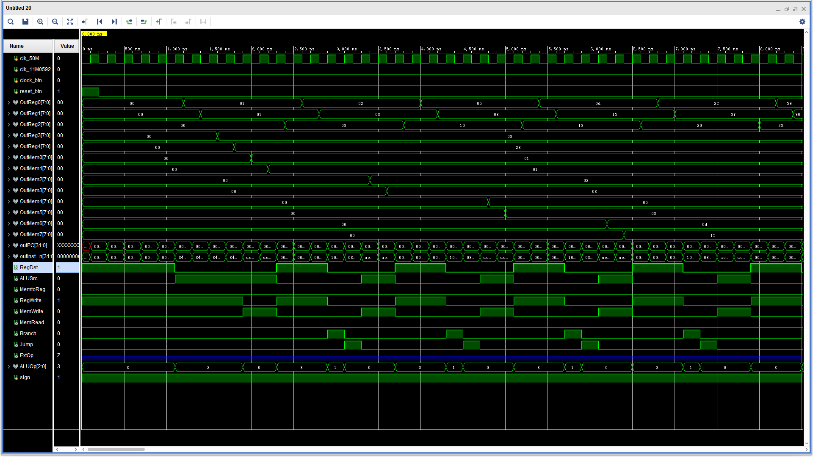
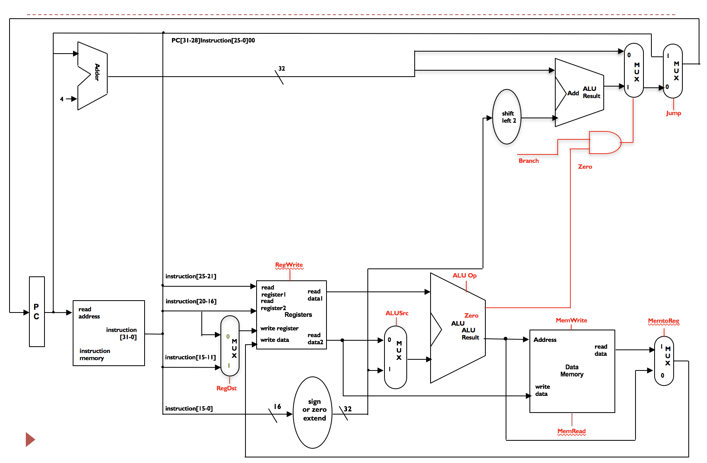
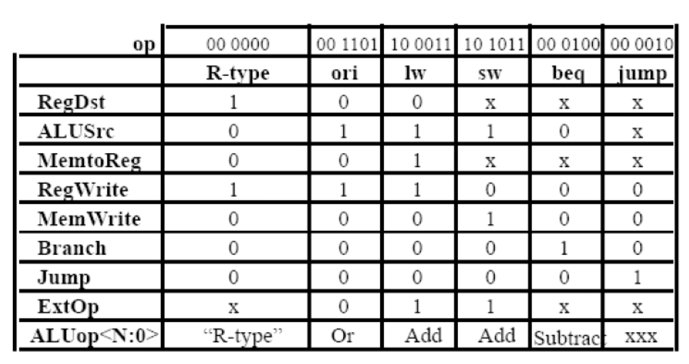

## 单周期CPU实验报告

计63 康鸿博 2016011314
计65 王艺涵 2016011365

完成了32位的单周期CPU设计、模拟。

#### 项目说明

给出整个项目目录。

仿真文件在srcs/sim_1/new/test.sv中

#### 试验结果

<center>

</br>
仿真结果：OutReg为寄存器，OutMem为数据内存（后8位）。计算Fibonacci。
</center>

#### 工程说明

控制信号定义、计算机结构与 PPT 结构相同，各文件功能与文件名相同。模块功能十分简单，这里不做赘述。

1. MUX5, MUX32： 5、32位数据选择器
2. PC：负责更新PC。
3. InstMem：指令地址空间，负责根据PC读指令。
4. DataMem：数据地址空间，负责数据读写。
5. Extend：完成16到32位的数据转换（立即数）。
6. Control：生成控制信号（与PPT中相同）
7. ALU：完成数值计算。
8. Register：完成寄存器堆读写。
9. thinpad_top：顶层。约定各模块连接关系。

<center>

</br>
单周期结构。控制信号由Control生成。
</center>

<center>

</br>
控制信号生成。实现时x取0。
</center>

#### 计算 Fibonacci

满足PPT中规定的语言格式。

```
sub $0 $0 $0 // numA
sub $1 $1 $1 // numB
sub $2 $2 $2 // save addr
sub $3 $3 $3 // inc
sub $4 $4 $4 // end pos
or $0 1
or $1 1
or $3 8
or $4 40
sw $2 $0 0
sw $2 $1 4
add $2 $3 $2
add $0 $1 $0
add $0 $1 $1
beq $2 $4 1
jmp 9
jmp 0
```

```
00000000 00000000 00000000 00100010
00000000 00100001 00001000 00100010
00000000 01000010 00010000 00100010
00000000 01100011 00011000 00100010
00000000 10000100 00100000 00100010
00110100 00000000 00000000 00000001
00110100 00100001 00000000 00000001
00110100 01100011 00000000 00001000
00110100 10000100 00000000 00101000
10101100 01000000 00000000 00000000
10101100 01000001 00000000 00000100
00000000 01000011 00010000 00100000
00000000 00000001 00000000 00100000
00000000 00000001 00001000 00100000
00010000 01000100 00000000 00000001
00001000 00000000 00000000 00001001
00001000 00000000 00000000 00000000
```